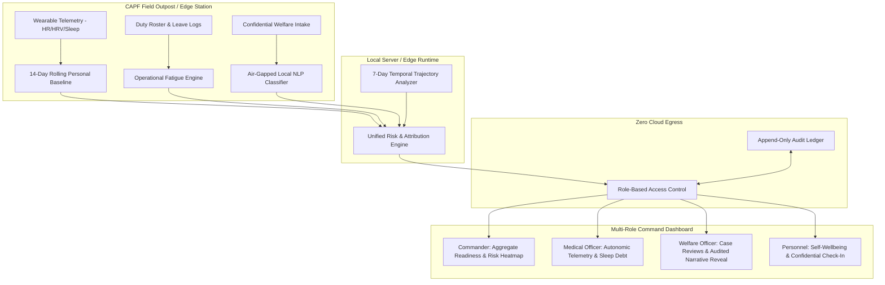

# SAJAG – AI-Powered Personnel Stress & Welfare Monitoring System

[](https://www.sih.gov.in/)
[](#)
[](#)
[](#)
[](#)

> **Tagline**: *"Early Signals. Better Welfare. Human Action."*

---

## 1. Executive Summary & SIH Problem Statement

Central Armed Police Forces (CAPF) personnel operate in high-altitude outposts, counter-insurgency sectors, and isolated border postings under extreme operational strain. Traditional commercial health dashboards rely on generic population cutoffs and single-biometric alerts. In armed forces environments, **biometrics alone produce catastrophic blind spots**.

**SAJAG (SIH26186)** unifies three distinct operational streams into a transparent, explainable decision-support system:
1. **Physiological Stream**: Evaluates autonomic recovery against an **individual-referenced 14-day rolling personal baseline** (Resting HR, HRV, sleep duration).
2. **Operational Strain Stream**: Quantifies cumulative consecutive duty shifts, nocturnal patrol density, and days since sanctioned home leave.
3. **Welfare & Grievance Stream**: Ingests voluntary check-ins and confidential welfare requests processed by an **air-gapped local NLP engine** with zero external cloud transmission.

---

## 2. Why Single-Biometric Trackers Fail

```
Conventional Fitness Trackers:
[ Heart Rate Normal ]  ──▶ "Soldier is 100% Fit"  ──▶ ❌ BLIND SPOT: 18 continuous duty days,
                                                        43-day leave deficit, hospitalized parent.

SAJAG Multi-Pillar Architecture:
[ Physiological: Stable ]
            +
[ Operational: 18 Duty Days ]  ──▶ Multi-Pillar Convergence ──▶ 🚨 HUMAN REVIEW REQUIRED
            +
[ Welfare: Open Emergency ]
```

---

## 3. High-Level System Architecture



---

## 4. Deterministic SIH Demo Scenarios

The system includes 4 deterministic evaluation scenarios accessible via the top navigation bar:

| Scenario | Personnel | Biometrics | Operational Burden | Welfare Friction | System Verdict | Recommended Action |
|---|---|---|---|---|---|---|
| **Scenario A** | PX-1078 | Elevated (HR +28%, HRV -41%) | Manageable | None | **Elevated Physical Strain** | Rest, hydration, light duty |
| **Scenario B** *(Killer Demo)* | PX-1042 | **Completely Normal** (HR 64, HRV 58) | **18 consecutive days**, 5 night shifts | **Critical family emergency** | **HUMAN REVIEW REQUIRED** | Emergency leave review, roster adjustment |
| **Scenario C** | PX-1124 | Recovering | Rotated off active shift | Resolved | **Recovering** | Continue post-rotation recovery |
| **Scenario D** | PX-1390 | Sensor gaps (<3 days data) | Missing roster link | None | **LOW CONFIDENCE (Calibration Pending)** | Manual verification, data sync check |

---

## 5. 3-Minute SIH Judge Demonstration

1. **Step 1 (Command Overview)**: View the 2D Operational vs Physiological Heatmap. Explain why a single health score is inadequate.
2. **Step 2 (Scenario B Drilldown)**: Switch to **Scenario B (PX-1042)**. Show that biometrics are normal, but operational duty (18 days) and welfare friction trigger **Human Review Required**.
3. **Step 3 (Waterfall Attribution)**: Demonstrate the mathematically transparent score decomposition (Operational: 45%, Welfare: 35%, Convergence Bonus: +8, Physiological: 20%).
4. **Step 4 (Welfare Officer Action)**: Switch role to Welfare Officer, perform an **audited source text reveal**, and log a supportive **Duty Roster Adjustment**.
5. **Step 5 (Audit Trail)**: Navigate to the **Audit Ledger** to prove that the sensitive unmasking and intervention were immutably recorded.
6. **Step 6 (Edge Mode Check)**: Toggle **"EDGE / OFFLINE MODE"** in the header to demonstrate 100% local, air-gapped calculation capability.

---

## 6. Key Innovations & Security Safeguards

- **Strictly Non-Diagnostic**: SAJAG never diagnoses psychiatric or cardiac disease. It computes operational strain and recovery deficits.
- **Air-Gapped Welfare NLP**: Simulates local DistilBERT categorization (Family Support, Leave, Housing, Workload, Medical, Administration) with zero external LLM dependencies.
- **Data Minimization & RBAC**:
  - *Commanders* see unit readiness and roster density, but cannot inspect personal biometrics or family narratives.
  - *Medical Officers* see physiological recovery curves, but are partitioned away from domestic grievances.
  - *Welfare Officers* see masked summaries; revealing raw text generates an immutable audit record.
- **Explainable Attribution**: Zero unexplainable black-box AI scores. Every recommendation is decomposable into explicit drivers.

---

## 7. Technology Stack

- **Frontend**: React 19, TypeScript ~5.8, Tailwind CSS v4, Motion, Lucide React, Recharts.
- **Backend & Serving**: Express.js 4.21, TypeScript via `tsx` (dev) and `esbuild` bundled CommonJS (production `dist/server.cjs`).
- **Engine Architecture**: Pure TypeScript modular engines (`baselineEngine.ts`, `physiologicalEngine.ts`, `operationalEngine.ts`, `welfareEngine.ts`, `unifiedRiskEngine.ts`, `rbacEngine.ts`).
- **Verification Suite**: Integrated automated test runner (`npm test`) validating 32 core test assertions.

---

## 8. Local Setup & Verification

```bash
# 1. Install dependencies
npm install

# 2. Run automated test suite (32 tests)
npm test

# 3. Type check & static analysis
npm run lint

# 4. Compile production build
npm run build

# 5. Launch local server (binds to http://localhost:3000)
npm run start
```

---

## 9. Comprehensive Documentation Suite

For detailed technical specifications, refer to the `docs/` directory:
- [Final System Audit](docs/SAJAG_FINAL_AUDIT.md)
- [Security Review & RBAC Architecture](docs/SAJAG_SECURITY_REVIEW.md)
- [Model Card & Technical Specs](docs/SAJAG_MODEL_CARD.md)
- [System Architecture & Data Flow](docs/SAJAG_ARCHITECTURE.md)
- [SIH Judge Demonstration Guide](docs/SAJAG_DEMO_GUIDE.md)
- [Automated Test Report](docs/SAJAG_TEST_REPORT.md)
- [System Limitations & Operational Boundaries](docs/SAJAG_LIMITATIONS.md)

---
*Developed for Smart India Hackathon 2026 | Ministry of Home Affairs (SIH26186)*
