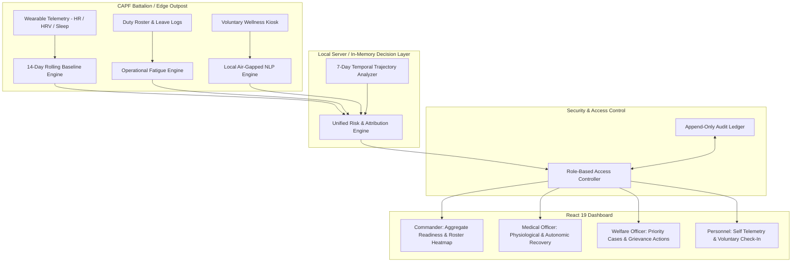

# SAJAG System Architecture & Data Flow
**Project**: SAJAG – AI-Powered Personnel Stress & Welfare Monitoring System  
**SIH Problem Statement**: SIH26186 (Ministry of Home Affairs)  

---

## 1. High-Level Architecture Diagram

---

## 2. Component Specifications

### 2.1 Edge Data Ingestion & Baselines
- Telemetry arriving from wearable devices or daily outpost check-ins is fed into `src/engines/baselineEngine.ts`.
- The engine calculates a running 14-day median and standard deviation for each personnel member individually.
- Spurious reading rejection: Outliers > 1.5x IQR from the 1st/3rd quartile are stripped prior to standard deviation calculations.

### 2.2 Operational Duty & Circadian Analysis
- `src/engines/operationalEngine.ts` parses roster logs to calculate:
  - Cumulative consecutive days on active shift.
  - Frequency of nocturnal patrols over a 7-day rolling window.
  - Elapsed calendar days since sanctioned home leave.
  - Environmental terrain factor (Border, High Altitude, Field, Peace).

### 2.3 Air-Gapped Local Welfare NLP
- `src/engines/welfareEngine.ts` parses voluntary text reports using local dictionary matchers and token scoring.
- Zero network egress: classification occurs entirely inside the local node boundary.
- Sensitive narrative masking: all raw text is replaced with non-sensitive semantic indicators unless unmasked by authorized welfare officers.

### 2.4 Unified Decision Synthesis
- `src/engines/unifiedRiskEngine.ts` computes the composite score:
  $$\text{Score} = (W_{\text{phys}} \times S_{\text{phys}}) + (W_{\text{ops}} \times S_{\text{ops}}) + (W_{\text{welfare}} \times S_{\text{welfare}}) + \text{Convergence Bonus}$$
- Detects multi-pillar convergence and assigns explainable waterfall points.

### 2.5 Role-Based Presentation & Audit
- `src/engines/rbacEngine.ts` validates requests by role and officer identifier.
- `server.ts` logs all data interactions into an immutable in-memory audit store viewable via `AuditView.tsx`.
